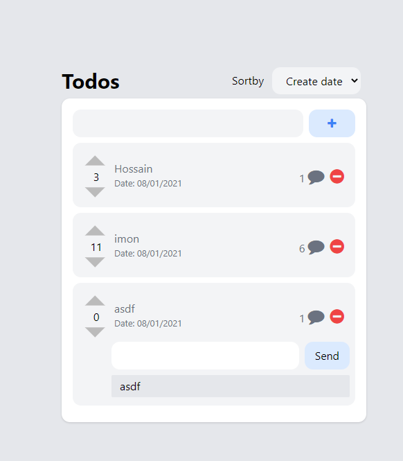

UpsellX Collector
================
> Todo challenge .
## Goals
- Create Todo
- Remove Todo
- Upvote and downvote todo list items. 
- Sort by  date added, alphabetical or by votes
- Customers able to comment on to do list items
  
## System Diagram:


## Technology
- ### Server/Backend
  - JavaScript
  - Expressjs
  - Node.js
  - MongoDB

- ### Web/Frontend
  - JavaScript
  - React
  - Redux
  - Tailwindcss 

  
## Docker Installation
* Cloning the repo

```bash
$ git clone https://github.com/imonhossain/todo-assignemnt.git
```
* Building an image

```bash
$ docker-compose build
```

* Running containers

```bash
$ docker-compose up
```

* Stopping containers

```bash
$ docker-compose down
```
## Todo App
### [http://localhost](http://localhost/)

